<div align="center">
  
</div>

<p align="center">
  <a href="https://legion.opusaether.com"></a>
  <a href="https://www.npmjs.com/package/@opus-aether-ai/legion-core"></a>
  <a href="https://github.com/Opus-Aether-AI/legion-core/releases"></a>
  <a href="https://github.com/Opus-Aether-AI/legion-core/actions/workflows/legion-ci.yml"></a>
  <a href="LICENSE"></a>
  
</p>

> **legion-core** is the model-agnostic orchestration engine behind Legion:
> routing, fan-out, review, observability, self-learning, healing, and the
> `legion-run` domain-plugin pipeline.

Use it directly, or build your own domain plugins on top of it.

## Quickstart

Install once, then run Legion from any git repo. No repo-local config is needed;
state and reports are created automatically under `~/.legion/projects/<repo-id>/`.

```bash
npm install -g @opus-aether-ai/legion-core

cd ~/code/any-app
legion-doctor --repo .
legion-state --repo .
```

One-off usage without installing globally:

```bash
npx --package @opus-aether-ai/legion-core legion-doctor --repo .
```

Expected doctor result: `0 fail`. A router warning is only blocking if your
Claude config forces traffic through the local router.

## What Legion Core Does

Your plugin owns the product/domain decisions. Legion Core owns the execution
pipeline and evidence.

```mermaid
flowchart LR
  U["User prompt<br/>goal + context"] --> P["Domain plugin<br/>brief, rules, gates, evals"]
  P --> R["legion-run<br/>fixed pipeline contract"]

  subgraph C["Legion Core enforced pipeline"]
    D["Doctor<br/>health"] --> H["Hints<br/>prior learning"]
    H --> PL["Plan<br/>plugin hook"]
    PL --> RO["Route<br/>model + executor"]
    RO --> F["Fanout + Apply<br/>parallel slices"]
    F --> RV["Review<br/>independent verdict"]
    RV --> VE["Validate + Evaluate<br/>plugin hooks"]
    VE --> RP["Report<br/>HTML + JSON"]
    RP --> SH["Share<br/>work split + cost"]
    SH --> LN["Learn<br/>future hints"]
    LN --> HE["Heal<br/>repair plan"]
  end

  R --> D
  HE --> A["Required artifacts<br/>plan, slices, fanout, review, eval,<br/>reports, share, learn, heal"]
```



The important split:

| Stage | Purpose |
|---|---|
| `share` | Evidence/accounting: proves who did the work, cost, latency, and Codex-vs-Opus split. It is not a planning step, but it belongs in the proof trail. |
| `learn` | Stores outcome memory so future runs get better hints before they start. |
| `heal` | Looks at failures and produces a repair plan, or in explicit heal mode, opens a fix PR. |

## Use `legion-run`

`legion-run` is the default entrypoint for domain plugins. It enforces the same
full-app pipeline every time and fails if required artifacts are missing.

```bash
legion-run \
  --plugin-manifest /path/to/my-plugin/legion-plugin.toml \
  --repo . \
  --task "Build organization invitations" \
  --json
```

The JSON output includes `run_dir`. Open:

```text
<run_dir>/legion-observability.html
```

That report shows the stages, artifacts, validation results, review findings,
cost/latency evidence, self-learning output, and heal plan.

## Build A Domain Plugin

A domain plugin has one required machine surface and one optional agent surface:

```text
legion-plugin.toml
  Required. Contract for legion-run. This is where you name the executable hooks.

SKILL.md
  Optional. Instructions for Codex/Claude/Cursor when you want natural-language
  skill activation.
```

The hooks named under `[commands]` are **executables**, not skills. They can be
shell, Node, Python, or private Legion Code CLIs.

```toml
[plugin]
name = "support-app-builder"
kind = "domain-plugin"

[pipeline]
profile = "legion.full_app.v1"
entrypoint = "legion-run"

[commands]
plan = "support-plan"
validate = "support-validate"
evaluate = "support-eval"
```

What the hooks do:

| Hook | What it returns |
|---|---|
| `plan` | Writes `plan.json`. It may also write `slices.jsonl`; if it does not, Legion Core generates a compact TDD slice set from the plan brief. |
| `validate` | Runs app gates such as tests, typecheck, lint, build, browser checks. |
| `evaluate` | Scores whether the domain goal was satisfied. |

Minimal plugin layout:

```text
support-app-builder/
  legion-plugin.toml
  bin/
    support-plan
    support-validate
    support-eval
  SKILL.md        # optional
```

Full copy-pasteable guide: [docs/domain-plugins.md](docs/domain-plugins.md).

## Core Commands

| Command | Use |
|---|---|
| `legion-run` | Run a domain plugin through the fixed full-app pipeline. |
| `legion-doctor` | Check install, repo, routing, state, and plugin health. |
| `legion-route` | Resolve a task archetype to model, executor, sandbox, and effort. |
| `legion-fanout` | Run independent slices in parallel and collect/apply diffs. |
| `legion-delegate` | Send one scoped task or review to a configured executor. |
| `legion-report` | Generate/open HTML and JSON observability reports. |
| `legion-share` | Show work split, token/cost accounting, and balance status. |
| `legion-self-learn` | Record outcomes and produce future run hints. |
| `legion-heal` | Plan or execute repairs for doctor/test failures. |
| `legion-bench` | Run repeatable benchmark and demo-readiness checks. |

## Bundled Plugins

| Plugin | Gives you |
|---|---|
| **legion-orchestrate** | `legion-run` for domain plugins plus `legion-fanout` for lower-level parallel delivery. |
| **legion-router** | `legion-route`, `legion-delegate`, Codex/Cursor/Claude executors, worktrees, routing policy, and cost tables. |
| **legion-observability** | `legion-doctor`, `legion-trace`, `legion-report`, `legion-share`, `legion-self-learn`, `legion-heal`, `legion-eval`, and `legion-bench`. |
| **legion-code-intel** | Optional TypeScript/Pyright diagnostics and `legion.code-intel.v1` artifacts. |
| **legion-setup** | Install/update flow and Codex/Cursor bridge wiring. |
| **legion-codex-mode** | Codex-side routing guidance and skill wiring. |

## Prove It Works

Run the single-task FieldOps benchmark before a demo or release:

```bash
legion-bench corpus \
  --corpus fieldops-triage-e2e \
  --repo . \
  --mode legion-fanout-review \
  --baseline legion-fanout-review \
  --json --strict
```

It passes only if Legion can route, fan out, apply code, review, evaluate, emit
observability HTML, record self-learning data, run heal planning, and pass the
nested core bench.

## More Docs

- [Build domain plugins](docs/domain-plugins.md)
- [Build an agent on Legion Core](docs/building-an-agent.md)
- [Benchmarking](docs/benchmarking.md)
- [Self-learning and heal loop](docs/self-learning.md)
- [Sync with Legion Code](docs/sync-with-legion-code.md)

## Quality

Local gates:

```bash
bats tests/
tests/python/run-tests.sh tests/python
legion-observability/bin/legion-doctor --repo . --strict-demo
```

## License

[Apache-2.0](LICENSE). Enterprise support and pilots: [ENTERPRISE.md](ENTERPRISE.md).
