<div align="center">
  
</div>

<p align="center">
  <a href="https://legion.opusaether.com"></a>
  <a href="https://www.npmjs.com/package/@opus-aether-ai/legion-core"></a>
  <a href="https://github.com/Opus-Aether-AI/legion-core/releases"></a>
  <a href="https://github.com/Opus-Aether-AI/legion-core/actions/workflows/legion-ci.yml"></a>
  <a href="LICENSE"></a>
  
</p>

> **legion-core** is the model-agnostic orchestration engine under the hood of
> an AI agent: **models, harnesses, loops, self-improving agents** — the stack,
> not another wrapper. Routing, fan-out, review, observability, self-learning,
> healing, and the `legion-run` heavy-task lifecycle.

The parts that make an AI agent actually work aren't in a thread or a YouTube
video — they're under the hood: the **models**, the **harnesses** they run in,
the **loops** that verify and heal, and the **self-improving agents** built on
top. legion-core is exactly that layer.

Use it directly for major work, or build your own domain plugins on top of it.

## Quickstart

Install once, then run Legion from any git repo. No repo-local config is needed;
state and reports are created automatically under `~/.legion/projects/<repo-id>/`.

```bash
npm install -g @opus-aether-ai/legion-core

cd ~/code/any-app
legion-doctor --repo .
legion-state --repo .
```

One-off usage without installing globally:

```bash
npx --package @opus-aether-ai/legion-core legion-doctor --repo .
```

Expected doctor result: `0 fail`. A router warning is only blocking if your
Claude config forces traffic through the local router.

## Choose The Right Entrypoint

You do not need the full `legion-run` pipeline for every task. Use the smallest
Legion surface that gives you the proof you need.

| Situation | Use | What happens |
|---|---|---|
| One small coding task | `legion-delegate run` | Sends one scoped task to the routed executor and returns a metered diff. |
| Review the current diff | `legion-delegate review` | Gets an independent structured review from the configured reviewer. |
| A few independent slices | `legion-fanout` | Runs multiple slices in parallel, collects results, and can apply safe diffs. |
| Bigger feature/refactor | `legion-orchestrate` | Agent playbook for decomposition, fan-out, cross-review, synthesis, and gates. |
| Any heavy task with a plan and gates | `legion-run` direct mode | Runs doctor, prior hints, plan, route, fan-out/apply, review, validate, evaluate, report, share, learn, and heal. |
| Reusable domain workflow | `legion-run` with a domain plugin | Same lifecycle, but the plan/validate/evaluate commands come from the plugin. |
| Inspect what happened | `legion-report`, `legion-share` | Shows observability HTML, cost, latency, status, and work split. |
| Teach Legion from a result | `legion-self-learn`, `legion-heal` | Records outcomes and plans repairs for failures. |

Small task:

```bash
legion-delegate run \
  --repo . \
  --archetype fix-bug \
  --task "Fix the empty-state copy in the settings page and add a focused test"
```

Review a diff:

```bash
legion-delegate review \
  --repo . \
  --archetype final-review \
  --base HEAD
```

Parallel slices:

```bash
cat > /tmp/legion-slices.jsonl <<'JSONL'
{"archetype":"implement-feature","task":"Add the export API route"}
{"archetype":"write-tests","task":"Add tests for the export API route"}
{"archetype":"implement-feature","task":"Add the export button in the UI"}
JSONL

legion-fanout --repo . --slices /tmp/legion-slices.jsonl --apply --json
```

Larger work in an agent conversation:

```text
Use legion-orchestrate to build the export workflow. Decompose it, fan out the
safe slices, get reviewer sign-off, apply the good diffs, and run the repo gates.
```

Heavy task with no plugin:

```bash
legion-run \
  --repo . \
  --task "Add organization invitations with tests and review" \
  --name org-invitations \
  --plan-command "./scripts/legion-plan-org-invitations" \
  --validate-command "npm test && npm run build && printf '{\"ok\":true}\\n'" \
  --evaluate-command "./scripts/eval-org-invitations" \
  --json
```

Reusable domain-plugin run:

```bash
legion-run \
  --plugin-manifest /path/to/my-plugin/legion-plugin.toml \
  --repo . \
  --task "Build organization invitations" \
  --json
```

## What Legion Core Does

Your plugin owns the product/domain decisions. Legion Core owns the execution
pipeline and evidence.

```mermaid
flowchart LR
  U["User prompt<br/>goal + context"] --> P["Domain plugin<br/>brief, rules, gates, evals"]
  U --> A["Direct mode<br/>plan + validate + evaluate"]
  P --> R["legion-run<br/>heavy-task lifecycle"]
  A --> R

  subgraph C["Legion Core enforced pipeline"]
    D["Doctor<br/>health"] --> H["Hints<br/>prior learning"]
    H --> PL["Plan<br/>command or file"]
    PL --> RO["Route<br/>model + executor"]
    RO --> F["Fanout + Apply<br/>parallel slices"]
    F --> RV["Review<br/>independent verdict"]
    RV --> VE["Validate + Evaluate<br/>commands"]
    VE --> RP["Report<br/>HTML + JSON"]
    RP --> SH["Share<br/>work split + cost"]
    SH --> LN["Learn<br/>future hints"]
    LN --> HE["Heal<br/>repair plan"]
  end

  R --> D
  HE --> A["Required artifacts<br/>plan, slices, fanout, review, eval,<br/>reports, share, learn, heal"]
```



The important split:

| Stage | Purpose |
|---|---|
| `share` | Evidence/accounting: proves who did the work, cost, latency, and Codex-vs-Opus split. It is not a planning step, but it belongs in the proof trail. |
| `learn` | Stores outcome memory so future runs get better hints before they start. |
| `heal` | Looks at failures and produces a repair plan, or in explicit heal mode, opens a fix PR. |

## Use `legion-run`

Use `legion-run` for major work that needs the whole lifecycle: feature
development, app work, large refactors, migrations, or anything where you want
proof, learning, and a heal plan. You do not need a plugin for one-off work.

Direct mode:

```bash
legion-run \
  --repo . \
  --task "Add organization invitations with tests and review" \
  --name org-invitations \
  --plan-file ./plans/org-invitations.md \
  --plan-file ./plans/org-invitations-architecture.md \
  --validate-command "npm test && npm run build && printf '{\"ok\":true}\\n'" \
  --evaluate-command "./scripts/eval-org-invitations" \
  --json
```

Repeat `--plan-file` when the task needs multiple sources, such as a product
plan plus architecture notes. Relative paths are resolved from `--repo`.

Domain plugin mode:

```bash
legion-run \
  --plugin-manifest /path/to/my-plugin/legion-plugin.toml \
  --repo . \
  --task "Build organization invitations" \
  --json
```

The JSON output includes `run_dir`. Open:

```text
<run_dir>/legion-observability.html
```

That report shows the stages, artifacts, validation results, review findings,
cost/latency evidence, self-learning output, and heal plan. If the run fails,
the same directory still contains `failure.json`, `partial-summary.json`,
`artifact-manifest.json`, `legion-observability.html`, `self-learn.json`, and
`heal-plan.json`.

## Build A Domain Plugin

A domain plugin has one required machine surface and one optional agent surface:

```text
legion-plugin.toml
  Required. Contract for legion-run. This is where you name the executable hooks.

SKILL.md
  Optional. Instructions for Codex/Claude/Cursor when you want natural-language
  skill activation.
```

The hooks named under `[commands]` are **executables**, not skills. They can be
shell, Node, Python, or private Legion Code CLIs.

```toml
[plugin]
name = "support-app-builder"
kind = "domain-plugin"

[pipeline]
profile = "legion.heavy_task.v1"
entrypoint = "legion-run"

[commands]
plan = "support-plan"
validate = "support-validate"
evaluate = "support-eval"
```

What the hooks do:

| Hook | What it returns |
|---|---|
| `plan` | Writes `plan.json`. It may also write `slices.jsonl`; if it does not, Legion Core generates a compact TDD slice set from the plan brief. |
| `validate` | Runs app gates such as tests, typecheck, lint, build, browser checks. |
| `evaluate` | Scores whether the domain goal was satisfied. |

For new plugins, prefer `profile = "legion.heavy_task.v1"`. Existing
`legion.full_app.v1` manifests continue to work.

Minimal plugin layout:

```text
support-app-builder/
  legion-plugin.toml
  bin/
    support-plan
    support-validate
    support-eval
  SKILL.md        # optional
```

Full copy-pasteable guide: [docs/domain-plugins.md](docs/domain-plugins.md).

## Core Commands

| Command | Use |
|---|---|
| `legion-run` | Run a heavy task directly or through a domain plugin with the full lifecycle and evidence contract. |
| `legion-doctor` | Check install, repo, routing, state, and plugin health. |
| `legion-route` | Resolve a task archetype to model, executor, sandbox, and effort. |
| `legion-fanout` | Run independent slices in parallel and collect/apply diffs. |
| `legion-delegate` | Send one scoped task or review to a configured executor. |
| `legion-report` | Generate/open HTML and JSON observability reports. |
| `legion-share` | Show work split, token/cost accounting, and balance status. |
| `legion-self-learn` | Record outcomes and produce future run hints. |
| `legion-heal` | Plan or execute repairs for doctor/test failures. |
| `legion-bench` | Run repeatable benchmark and demo-readiness checks. |

## Bundled Plugins

| Plugin | Gives you |
|---|---|
| **legion-orchestrate** | `legion-run` for heavy tasks/domain plugins plus `legion-fanout` for lower-level parallel delivery. |
| **legion-router** | `legion-route`, `legion-delegate`, Codex/Cursor/Claude executors, worktrees, routing policy, and cost tables. |
| **legion-observability** | `legion-doctor`, `legion-trace`, `legion-report`, `legion-share`, `legion-self-learn`, `legion-heal`, `legion-eval`, and `legion-bench`. |
| **legion-code-intel** | Optional TypeScript/Pyright diagnostics and `legion.code-intel.v1` artifacts. |
| **legion-setup** | Install/update flow and Codex/Cursor bridge wiring. |
| **legion-codex-mode** | Codex-side routing guidance and skill wiring. |

## Prove It Works

Run the deterministic FieldOps `legion-run` benchmark before a demo or release:

```bash
legion-bench run --suite legion-run --repo . --json --strict
```

That no-spend suite runs the real `legion-run` lifecycle with stubbed model
commands. It passes only if direct mode can consume a plan command and validate
command, route and fan out slices, apply code, review, validate, emit HTML
reports, record validation-discovered learning, and run heal planning.

Run the live-model proof when you want to verify the full product path:

```bash
legion-doctor --repo . --strict-demo
legion-bench run --suite legion-run-live --repo . --json --strict \
  | tee /tmp/legion-run-live.json
```

The live suite spends real Codex model calls, preserves your real `HOME` so
Codex auth is available, and writes a temporary Python fixture repo. Expect it
to take several minutes and consume real model credits. It is a separate suite
so CI does not run it unless you explicitly ask for it.

The JSON output contains `html_artifacts`. Open the benchmark overview first,
then the nested Legion reports:

```bash
python3 - <<'PY' /tmp/legion-run-live.json
import json, sys
data = json.load(open(sys.argv[1]))
for case, links in data.get("html_artifacts", {}).items():
    print(case)
    for name, path in links.items():
        print(f"  {name}: {path}")
PY
```

Open the printed `benchmark_overview` file in a browser. It links to
`legion-report.html`, `legion-observability.html`, the artifact manifest, the
temporary fixture repo, live model fan-out evidence, validation output, and the
self-learning memory update.

## More Docs

- [Build domain plugins](docs/domain-plugins.md)
- [Build an agent on Legion Core](docs/building-an-agent.md)
- [Benchmarking](docs/benchmarking.md)
- [Self-learning and heal loop](docs/self-learning.md)
- [Sync with Legion Code](docs/sync-with-legion-code.md)

## Quality

Local gates:

```bash
bats tests/
tests/python/run-tests.sh tests/python
legion-observability/bin/legion-doctor --repo . --strict-demo
```

## License

[Apache-2.0](LICENSE). Enterprise support and pilots: [ENTERPRISE.md](ENTERPRISE.md).
