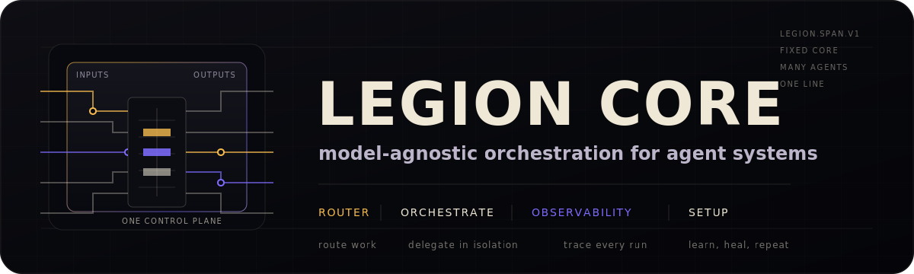

<div align="center">
  
</div>

> **legion-core** — the model-agnostic orchestration engine behind Legion. The base layer you build your own agents on.

One will commands a host of agents — **GPT-5.x via Codex**, **Cursor**, **Claude** (and humans). legion-core gives you the parts that aren't domain-specific: scoped multi-model **delegation**, **telemetry**, a **health check**, **self-learning**, and **auto-healing** — so a new agent project starts from a working spine instead of a blank page.

```bash
curl -fsSL https://raw.githubusercontent.com/Opus-Aether-AI/legion-core/main/scripts/install.sh | bash -s all
```

## What's inside (5 plugins)

| Plugin | Gives you |
|---|---|
| **legion-router** | `legion-delegate` (scoped task → any model in an isolated git worktree → verified, metered diff), `legion-cursor`, `legion-claude`, routing + cost tables (`routing.toml`, `costs.json`), `legion-route`/`legion-optimize`. |
| **legion-observability** | `legion.span.v1` telemetry + `legion-trace`/`legion-report`/`legion-otel-export`, and the loops: `legion-doctor`, `legion-self-learn`, `legion-heal`, `legion-eval`, `legion-share`. |
| **legion-orchestrate** | Multi-model goal orchestration (fan-out → cross-verify → synthesize). |
| **legion-setup** | Cross-harness install + Codex/Cursor bridges. |
| **legion-codex-mode** | Codex-side wiring. |

## Using legion-core as a base

legion-core is meant to be the foundation under a domain agent (e.g. a trading agent, a research agent). You bring the domain; the core brings the orchestration:

1. **Consume it** — vendor this repo or install its marketplace, then layer your own plugins/skills/agents on top.
2. **Delegate work** — hand scoped tasks to `legion-delegate` / `legion-orchestrate`; you get verified, metered diffs back without wiring a model harness yourself.
3. **Stay healthy** — wire `legion-doctor` into CI (it already gates this repo), and opt into `legion-heal` (`LEGION_HEAL=1`) to auto-PR fixes for what the doctor finds.
4. **Tune routing** — point `legion-router/config/routing.toml` + `costs.json` at the models/archetypes your agent should prefer.

See [`docs/building-an-agent.md`](docs/building-an-agent.md) for the full recipe and [`docs/self-learning.md`](docs/self-learning.md) for the learn/heal loop.

## Install as a package

legion-core is published as a public npm package, so a downstream agent can pin a
versioned copy of the engine (bins + scripts + plugins) instead of cloning. This is
additive — the marketplace / source-clone paths still work.

```bash
# Install it.
npm install @opus-aether-ai/legion-core            # or: bun add / pnpm add

# The engine CLIs are now on your project's bin path.
npx legion-doctor --help
npx legion-delegate run --archetype fix-bug --task "…" --repo .
```

Publishing is automated: the [`publish-package`](.github/workflows/publish-package.yml)
workflow runs on each GitHub Release (and on demand) and uses `NPM_TOKEN`. The package
version tracks the release version via release-please.

## Configuration

Copy [`.env.example`](.env.example) → `.env`. Runtime prerequisites: `gh` + `jq` + `git`; `codex` and `cursor-agent` CLIs (authenticated) for those executors; `ANTHROPIC_API_KEY` for Claude routing.

## AFK intake lane

The GitHub intake edge lets humans or telemetry file an issue, then hand it to an AFK Codex worker by label. It is queue-based (`concurrency: agent-intake`), bounded, and `implement` always opens a PR for human review; it never auto-merges.

```bash
# One-time label setup
gh label create 'agent:explore' --color 1d76db --description 'Run read-only AFK issue triage'
gh label create 'agent:implement' --color b60205 --description 'Run AFK implementation and open a PR'

# One-time secret setup
# Prefer CODEX_AUTH = contents of ~/.codex/auth.json from a machine with `codex login status`.
gh secret set CODEX_AUTH < ~/.codex/auth.json
# Fallback: you can set OPENAI_API_KEY instead and the workflow will log Codex in with it.
```

After that, adding `agent:explore` to an issue posts a short assessment comment, and adding `agent:implement` runs the same intake prompt in write mode and opens a PR whose body includes `Closes #N`. You can also run the thin `agent-intake-trigger` workflow manually with an issue number and mode.

## Quality

`legion-doctor` + the `bats` suite gate every change (`.github/workflows/`). Run locally:

```bash
bats tests/                                   # unit + component suite
legion-observability/bin/legion-doctor        # install / schema / MCP / bridge health
```

## Security

Report suspected vulnerabilities privately; see [SECURITY.md](SECURITY.md).

## Credits

legion-core is original integration code, built in conversation with a broader
agent-harness ecosystem. See [CREDITS.md](CREDITS.md) for full attribution,
including svineet/harness-bench, Harness-Bench, autoresearch, auto-harness, MCP,
Codex, Claude Code, Cursor, and the local validation toolchain.

## License

[Apache-2.0](LICENSE). This is the reusable, model-agnostic Legion engine.
