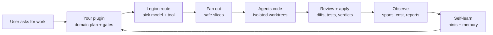

<div align="center">
  
</div>

<p align="center">
  <a href="https://legion.opusaether.com"></a>
  <a href="https://www.npmjs.com/package/@opus-aether-ai/legion-core"></a>
  <a href="https://github.com/Opus-Aether-AI/legion-core/releases"></a>
  <a href="https://github.com/Opus-Aether-AI/legion-core/actions/workflows/legion-ci.yml"></a>
  <a href="LICENSE"></a>
  
</p>

> **legion-core** — the model-agnostic orchestration engine behind Legion. The base layer you build your own agents, plugins, and app-building workflows on.

Legion lets one operator command many coding agents: **GPT-5.x via Codex**,
**Cursor**, **Claude**, and humans. legion-core gives custom plugins the reusable
engine: scoped multi-model **delegation**, **fan-out**, **telemetry**, a
**health check**, **self-learning**, and **auto-healing**.

## Quickstart

Install once, then use Legion from any git repo. No per-repo shell exports are
required; Legion automatically stores runtime state under
`~/.legion/projects/<repo-id>/`.

```bash
npm install -g @opus-aether-ai/legion-core

cd ~/code/any-app
legion-doctor --repo .
legion-state --repo .
```

Prefer the release installer if you want Legion to install/update the local
skill bundle and CLI shims together:

```bash
curl -fsSL https://github.com/Opus-Aether-AI/legion-core/releases/latest/download/install.sh | bash
```

If you do not want a global install:

```bash
npx --package @opus-aether-ai/legion-core legion-doctor --repo .
```

Expected Doctor result: `0 fail`. A router warning is acceptable unless your
Claude config forces traffic through `ANTHROPIC_BASE_URL=http://127.0.0.1:8082`.

## The Simple Idea

Your plugin decides what should happen. Legion Core executes the work, measures
it, reviews it, and learns from the result.



## Use It From A Plugin

Legion Core should not know your product domain. Put that knowledge in your own
plugin or skill: slice templates, evals, app gates, review rules, and recovery
policy.

```text
my-product-plugin/
  SKILL.md                    # when to use it and how it builds/reviews
  .claude-plugin/plugin.json   # plugin metadata
  evals/                       # optional golden tasks
  bin/                         # optional deterministic helpers
```

Minimal `SKILL.md`:

```md
---
name: product-app-builder
description: Use when building or changing this product with Legion Core.
---

For app changes:

1. Run `legion-self-learn hints --entity plugin:product-app-builder`.
2. Run `legion-doctor --repo . --strict-demo`.
3. Split the request into implementation, tests, and review slices.
4. Use `legion-fanout --slices slices.jsonl --repo . --apply --json`.
5. Run the repo's own gates, such as tests, lint, typecheck, and build.
6. Open evidence with `legion-report open latest`.
7. Record useful failures with `legion-self-learn record`.
```

Private Legion Code plugins use this same pattern: for example, an app-builder
plugin can translate a product request into backend/UI/test/review slices, and a
review-gate plugin can force final review plus repo gates before a PR. The
plugin owns those domain rules; Legion Core owns the execution and evidence.

## Build In Conversation

Most users should talk to Claude Code, Codex, or Cursor through their plugin
instead of memorizing commands.

```text
Use product-app-builder to add organization invitations to this app.

Plan the change, split backend/UI/tests/review slices, use Legion Core for
delegation, run the repo gates, then open the latest Legion report.
```

The plugin can then produce slices like:

```jsonl
{"archetype":"implement-feature","task":"Add organization invitation API, validation, and persistence."}
{"archetype":"implement-feature","task":"Add invitation UI states and form handling."}
{"archetype":"write-tests","task":"Add unit and integration tests for invitations."}
{"archetype":"final-review","task":"Review the full diff for correctness, security, and missing tests."}
```

Legion executes them:

```bash
legion-fanout --slices slices.jsonl --repo . --max-concurrency 3 --apply --json
legion-delegate review --repo . --archetype final-review --base HEAD
legion-report open latest
```

## State And Reports

By default, every repo gets a stable global state root:

```text
~/.legion/projects/<repo-id>/
  spans/        # legion.span.v1 telemetry
  registry/     # run-state records
  bench/        # benchmark artifacts
  reports/      # HTML reports
  self-learn/   # durable memory and scorecards
```

Useful commands:

```bash
legion-state --repo .               # show resolved state paths
legion-report path latest           # print latest HTML report path
legion-report open latest           # generate and open latest report
legion-share --window 1d --json     # inspect Codex-vs-Opus work split
```

Advanced users and CI can still override state with env vars or an optional
`.legion/config.toml`, but normal users should not need to configure anything.

## Prove The Pipeline Works

Run the bundled single-task benchmark before a release or demo. It only passes
if Legion can route, fan out, apply code, review, evaluate, emit observability
HTML, record self-learn data, run heal, and pass the nested core bench.

```bash
legion-bench corpus \
  --corpus fieldops-triage-e2e \
  --repo . \
  --mode legion-fanout-review \
  --baseline legion-fanout-review \
  --json --strict
```

The `fieldops-triage-e2e` corpus is a public regression fixture for Legion Core.
It is not the app-building API; it proves the engine still works end to end.

## What's inside (6 plugins)

| Plugin | Gives you |
|---|---|
| **legion-router** | `legion-delegate` (scoped task → any model in an isolated git worktree → verified, metered diff), `legion-cursor`, `legion-claude`, routing + cost tables (`routing.toml`, `costs.json`), `legion-route`/`legion-optimize`. |
| **legion-observability** | `legion.span.v1` telemetry + `legion-state`/`legion-trace`/`legion-report`/`legion-otel-export`, and the loops: `legion-doctor`, `legion-self-learn`, `legion-heal`, `legion-eval`, `legion-share`. |
| **legion-code-intel** | Optional repo-native TypeScript/Pyright diagnostics, changed-file gates, `legion.code-intel.v1` artifacts, and telemetry spans for benchmarkable code-intelligence checks. |
| **legion-orchestrate** | Multi-model goal orchestration (fan-out → cross-verify → synthesize). |
| **legion-setup** | Cross-harness install + Codex/Cursor bridges. |
| **legion-codex-mode** | Codex-side wiring. |

## Using legion-core as a base

legion-core is meant to be the foundation under a domain agent (e.g. a trading agent, a research agent). You bring the domain; the core brings the orchestration:

1. **Consume it** — vendor this repo or install its marketplace, then layer your own plugins/skills/agents on top.
2. **Delegate work** — hand scoped tasks to `legion-delegate` / `legion-orchestrate`; you get verified, metered diffs back without wiring a model harness yourself.
3. **Stay healthy** — wire `legion-doctor` into CI (it already gates this repo), and opt into `legion-heal` (`LEGION_HEAL=1`) to auto-PR fixes for what the doctor finds.
4. **Tune routing** — point `legion-router/config/routing.toml` + `costs.json` at the models/archetypes your agent should prefer.

See [`docs/building-an-agent.md`](docs/building-an-agent.md) for the full recipe and [`docs/self-learning.md`](docs/self-learning.md) for the learn/heal loop.

## Install as a package

legion-core is published as a public npm package, so a downstream agent can pin a
versioned copy of the engine (bins + scripts + plugins) instead of cloning. This is
additive — the marketplace / source-clone paths still work.

```bash
# Global CLI install.
npm install -g @opus-aether-ai/legion-core

# Project-pinned install.
npm install @opus-aether-ai/legion-core            # or: bun add / pnpm add
npx legion-doctor --repo .
npx legion-delegate run --archetype fix-bug --task "…" --repo .
npx legion-code-intel diagnostics --repo . --changed-only --json

# One-off commands without modifying package.json.
npx --package @opus-aether-ai/legion-core legion-doctor --repo .
npx --package @opus-aether-ai/legion-core legion-state --repo .
```

Package links:

- npmjs: <https://www.npmjs.com/package/@opus-aether-ai/legion-core>
- GitHub Packages mirror: <https://github.com/orgs/Opus-Aether-AI/packages/npm/package/legion-core>
- dist-tags: `npm view @opus-aether-ai/legion-core dist-tags`

Publishing is automated: [`release-please`](.github/workflows/release-please.yml)
cuts the release, then publishes to npmjs with Trusted Publishing / GitHub OIDC
and mirrors to GitHub Packages with `GITHUB_TOKEN`. Stable releases publish to
the npmjs `latest` dist-tag. The first package is live; before the next
automated publish, configure the npm Trusted Publisher for
`@opus-aether-ai/legion-core` at
<https://www.npmjs.com/package/@opus-aether-ai/legion-core/access> with
organization `Opus-Aether-AI`, repository `legion-core`, workflow filename
`release-please.yml`, environment `release`, and allowed action `npm publish`.
Each npm package supports one Trusted Publisher, so keep `release-please.yml` as
the canonical npmjs publisher.

## Configuration

Most users do not need repo-local Legion config. Runtime state auto-resolves per
repo under `~/.legion/projects/<repo-id>/`.

Use env vars only for CI, tests, or custom state locations:

```bash
export LEGION_STATE_ROOT=/path/to/state
export LEGION_TELEMETRY_DIR=$LEGION_STATE_ROOT/spans
export LEGION_REGISTRY_DIR=$LEGION_STATE_ROOT/registry
export LEGION_REPOS_FILE=$LEGION_STATE_ROOT/repos.jsonl
export LEGION_BENCH_DIR=$LEGION_STATE_ROOT/bench
export LEGION_REPORTS_DIR=$LEGION_STATE_ROOT/reports
```

Optional repo config:

```toml
[state]
root = ".legion/state"

[reports]
root = ".legion/reports"
```

Runtime prerequisites: `gh` + `jq` + `git`; `codex` and `cursor-agent` CLIs
(authenticated) for those executors; `ANTHROPIC_API_KEY` for Claude routing.

## AFK intake lane

The GitHub intake edge lets humans or telemetry file an issue, then hand it to an AFK Legion worker by label. It is queue-based (`concurrency: agent-intake`), bounded, routed through Legion archetypes, and `implement` always opens a PR for human review; it never auto-merges.

```bash
# One-time label setup
gh label create 'agent:explore' --color 1d76db --description 'Run read-only AFK issue triage'
gh label create 'agent:implement' --color b60205 --description 'Run AFK implementation and open a PR'

# One-time secret setup
# Preferred generic secret. For the current Codex-backed delegate backend, this
# is the contents of ~/.codex/auth.json from a machine with `codex login status`.
gh secret set LEGION_INTAKE_AUTH_JSON < ~/.codex/auth.json

# Compatibility alias for existing installs; not needed if the generic secret is set.
# gh secret set CODEX_AUTH < ~/.codex/auth.json

# Fallback if using API-key login instead of auth JSON.
# gh secret set OPENAI_API_KEY --body "$OPENAI_API_KEY"

# Optional routing overrides. Usually leave these unset and use the defaults:
# explore -> second-opinion-review, implement -> implement-feature.
gh variable set LEGION_INTAKE_EXPLORE_ARCHETYPE --body final-review
gh variable set LEGION_INTAKE_IMPLEMENT_ARCHETYPE --body hard-bug
# Optional explicit model override; usually leave unset so models.toml controls it.
# gh variable set LEGION_INTAKE_MODEL --body "$(legion-route --model-ref codex_workhorse)"
```

After that, adding `agent:explore` to an issue posts a short assessment comment, and adding `agent:implement` runs the same intake prompt in write mode and opens a PR whose body includes `Closes #N`. You can also run the thin `agent-intake-trigger` workflow manually with an issue number, mode, worker (`delegate`, `cursor`, or `custom`), optional `archetype` / `model` override, and optional `worker_bin` for a repo-local compatible runner. `legion-intake` also accepts `--worker` / `--worker-bin` / `LEGION_INTAKE_WORKER_BIN` for any runner that follows the Legion JSON result contract.

## Quality

`legion-doctor` + the `bats` suite gate every change (`.github/workflows/`). Run locally:

```bash
bats tests/                                   # unit + component suite
tests/python/run-tests.sh tests/python        # locked Python unit suite (uv.lock)
legion-observability/bin/legion-doctor        # install / schema / MCP / bridge health
```

## Security

Report suspected vulnerabilities privately; see [SECURITY.md](SECURITY.md).

## Credits

legion-core is original integration code, built in conversation with a broader
agent-harness ecosystem. See [CREDITS.md](CREDITS.md) for full attribution,
including svineet/harness-bench, autoresearch, auto-harness, MCP, Codex,
Claude Code, Cursor, and the local validation toolchain.

## License

[Apache-2.0](LICENSE). This is the reusable, model-agnostic Legion engine.
Enterprise support and pilots: see [ENTERPRISE.md](./ENTERPRISE.md).
