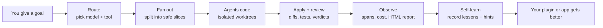

<div align="center">
  
</div>

<p align="center">
  <a href="https://www.npmjs.com/package/@opus-aether-ai/legion-core"></a>
  <a href="https://github.com/Opus-Aether-AI/legion-core/releases"></a>
  <a href="https://github.com/Opus-Aether-AI/legion-core/actions/workflows/legion-ci.yml"></a>
  <a href="LICENSE"></a>
  
</p>

> **legion-core** — the model-agnostic orchestration engine behind Legion. The base layer you build your own agents, plugins, and app-building workflows on.

Legion lets one operator command many coding agents: **GPT-5.x via Codex**, **Cursor**, **Claude**, and humans. legion-core gives you the parts that are useful in any agent project: scoped multi-model **delegation**, **fan-out**, **telemetry**, a **health check**, **self-learning**, and **auto-healing**.

```bash
curl -fsSL https://raw.githubusercontent.com/Opus-Aether-AI/legion-core/main/scripts/install.sh | bash
```

## The simple idea

Give Legion one goal. Legion picks the right worker, lets that worker edit in an
isolated git worktree, reviews the result, records cost/success telemetry, and
saves lessons for the next run.



## What you can build on it

**Build a plugin:** add your domain knowledge and commands, then let Legion
handle routing, model execution, telemetry, and learning.

```text
my-fieldops-plugin/
  SKILL.md                  # tells agents when and how to use your plugin
  .claude-plugin/plugin.json # name, description, version, metadata
  bin/fieldops-triage        # optional deterministic CLI your agents can call
```

Minimal `SKILL.md`:

```md
---
name: fieldops-triage
description: Use when a user asks to classify field-service tickets.
---

1. Read the ticket.
2. Decide category, urgency, required skill, required parts, and risk.
3. Use legion-delegate for code changes and legion-report for the run summary.
```

Minimal `.claude-plugin/plugin.json`:

```json
{
  "name": "fieldops-triage",
  "version": "0.1.0",
  "description": "Field-service ticket triage workflows built on legion-core.",
  "license": "Apache-2.0"
}
```

**Use it to build an app:** keep your app in its own repo, then ask Legion to
make scoped changes.

```bash
# See which worker Legion would choose.
legion-route implement-feature --task "Build the ticket triage page"

# Run one coding task and get a metered diff back.
legion-delegate run \
  --repo . \
  --archetype implement-feature \
  --task "Add a ticket triage page with filters, priority badges, and tests"

# For bigger work, run several scoped slices in parallel.
legion-fanout --slices slices.jsonl --repo . --apply --json

# See cost, latency, and success as JSON or HTML.
legion-report --trace latest --html > legion-report.html

# Record what happened so the harness can learn.
legion-self-learn record \
  --entity plugin:fieldops-triage \
  --summary "The app needed stricter priority rules for freezer outages."
```

Example `slices.jsonl`:

```jsonl
{"archetype":"implement-feature","task":"Create the triage API and tests"}
{"archetype":"frontend-review","task":"Review the triage UI for usability"}
{"archetype":"final-review","task":"Review the full diff before merge"}
```

### Build a full app in conversation

When you are using Claude Code or Codex, you usually do not type every Legion
command yourself. You ask the agent to use Legion, and the agent should plan,
slice, delegate, review, test, and report.

Example first message:

```text
Build a FieldOps dispatch app with Legion.

The app should let dispatchers paste a service ticket, classify category and
urgency, assign a required skill, show required parts, show ETA risk, and keep a
history of triage decisions.

Use Legion Core for the build:
1. Run legion-doctor preflight.
2. Make a short implementation plan.
3. Break the app into backend, UI, tests, and review slices.
4. Use legion-fanout for independent coding slices.
5. Apply the diffs only after review.
6. Run tests.
7. Generate legion-report HTML and record self-learn output.
```

What the agent should do:

```bash
# 1. Check the harness before spending on model work.
legion-self-learn hints --entity skill:legion-orchestrate
legion-doctor --only codex
legion-doctor --only router

# 2. Create dependency-aware slices.
cat > slices.jsonl <<'JSONL'
{"archetype":"implement-feature","task":"Create the ticket triage API, validation, and persistence."}
{"archetype":"implement-feature","task":"Create the dispatcher UI with ticket input, result cards, history, and loading/error states."}
{"archetype":"write-tests","task":"Add unit and integration tests for triage rules and app workflows."}
{"archetype":"frontend-review","task":"Review the dispatcher UI for clarity, density, and responsive layout."}
{"archetype":"final-review","task":"Review the final app diff for correctness, security, and missing tests."}
JSONL

# 3. Let Legion run the independent implementation slices.
legion-fanout --slices slices.jsonl --repo . --max-concurrency 3 --apply --json

# 4. Ask for a final independent review.
legion-delegate review --archetype final-review --repo . --base HEAD

# 5. Run the app gates.
npm test
npm run lint
npm run build

# 6. Produce evidence.
legion-report --trace latest --html > legion-report.html
legion-share --window 1d --json
legion-self-learn record --entity app:fieldops-dispatch --summary "Built first FieldOps dispatch workflow."
```

Example follow-up messages:

```text
Use Legion to add CSV import and export. Keep it as one backend slice, one UI
slice, one test slice, and one final-review slice.
```

```text
Use Legion to harden this app for a demo. Run doctor, run the app tests, get a
final-review verdict, produce the HTML report, and show me the artifact paths.
```

```text
Use Legion self-learn. Record what failed in this build, run the learning loop,
then rerun the benchmark or tests that prove the fix worked.
```

## Prove the full pipeline works

Run the bundled single-task benchmark before a demo. It asks Legion to solve one
small coding task and only passes if Legion can route, fan out, apply code,
review, evaluate, emit a full pipeline HTML report, record self-learn data, run
heal, and pass the core bench.

```bash
legion-bench corpus \
  --corpus fieldops-triage-e2e \
  --repo . \
  --mode legion-fanout-review \
  --baseline legion-fanout-review \
  --json --strict \
  --report-md .legion/fieldops-e2e-report.md
```

The useful outputs are:

| Output | What it proves |
|---|---|
| `fanout.json` | Legion split the task and applied a diff. |
| `review.json` | A final review agent ran on the result. |
| `score.json` | The app task passed its golden evaluator. |
| `legion-report.html` | Full pipeline report: task, timeline, artifacts, diff, observability, self-learn, heal, raw JSON. |
| `legion-observability.html` | Raw observability cost/success/latency report. |
| `self-learn-run.json` | Self-learning recorded the run and refreshed memory. |

## What's inside (5 plugins)

| Plugin | Gives you |
|---|---|
| **legion-router** | `legion-delegate` (scoped task → any model in an isolated git worktree → verified, metered diff), `legion-cursor`, `legion-claude`, routing + cost tables (`routing.toml`, `costs.json`), `legion-route`/`legion-optimize`. |
| **legion-observability** | `legion.span.v1` telemetry + `legion-trace`/`legion-report`/`legion-otel-export`, and the loops: `legion-doctor`, `legion-self-learn`, `legion-heal`, `legion-eval`, `legion-share`. |
| **legion-orchestrate** | Multi-model goal orchestration (fan-out → cross-verify → synthesize). |
| **legion-setup** | Cross-harness install + Codex/Cursor bridges. |
| **legion-codex-mode** | Codex-side wiring. |

## Using legion-core as a base

legion-core is meant to be the foundation under a domain agent (e.g. a trading agent, a research agent). You bring the domain; the core brings the orchestration:

1. **Consume it** — vendor this repo or install its marketplace, then layer your own plugins/skills/agents on top.
2. **Delegate work** — hand scoped tasks to `legion-delegate` / `legion-orchestrate`; you get verified, metered diffs back without wiring a model harness yourself.
3. **Stay healthy** — wire `legion-doctor` into CI (it already gates this repo), and opt into `legion-heal` (`LEGION_HEAL=1`) to auto-PR fixes for what the doctor finds.
4. **Tune routing** — point `legion-router/config/routing.toml` + `costs.json` at the models/archetypes your agent should prefer.

See [`docs/building-an-agent.md`](docs/building-an-agent.md) for the full recipe and [`docs/self-learning.md`](docs/self-learning.md) for the learn/heal loop.

## Install as a package

legion-core is published as a public npm package, so a downstream agent can pin a
versioned copy of the engine (bins + scripts + plugins) instead of cloning. This is
additive — the marketplace / source-clone paths still work.

```bash
# Add it to a project.
npm install @opus-aether-ai/legion-core            # or: bun add / pnpm add

# The engine CLIs are now on your project's bin path.
npx legion-doctor --help
npx legion-delegate run --archetype fix-bug --task "…" --repo .

# Or run a CLI without adding it to package.json.
npx --package @opus-aether-ai/legion-core legion-doctor --help
```

Package links:

- npmjs: <https://www.npmjs.com/package/@opus-aether-ai/legion-core>
- GitHub Packages mirror: <https://github.com/orgs/Opus-Aether-AI/packages/npm/package/legion-core>
- dist-tags: `npm view @opus-aether-ai/legion-core dist-tags`

Publishing is automated: [`release-please`](.github/workflows/release-please.yml)
cuts the release, then publishes to npmjs with Trusted Publishing / GitHub OIDC
and mirrors to GitHub Packages with `GITHUB_TOKEN`. Stable releases publish to
the npmjs `latest` dist-tag. The first package is live; before the next
automated publish, configure the npm Trusted Publisher for
`@opus-aether-ai/legion-core` at
<https://www.npmjs.com/package/@opus-aether-ai/legion-core/access> with
organization `Opus-Aether-AI`, repository `legion-core`, workflow filename
`release-please.yml`, environment `release`, and allowed action `npm publish`.
Each npm package supports one Trusted Publisher, so keep `release-please.yml` as
the canonical npmjs publisher.

## Configuration

Copy [`.env.example`](.env.example) → `.env`. Runtime prerequisites: `gh` + `jq` + `git`; `codex` and `cursor-agent` CLIs (authenticated) for those executors; `ANTHROPIC_API_KEY` for Claude routing.

## AFK intake lane

The GitHub intake edge lets humans or telemetry file an issue, then hand it to an AFK Legion worker by label. It is queue-based (`concurrency: agent-intake`), bounded, routed through Legion archetypes, and `implement` always opens a PR for human review; it never auto-merges.

```bash
# One-time label setup
gh label create 'agent:explore' --color 1d76db --description 'Run read-only AFK issue triage'
gh label create 'agent:implement' --color b60205 --description 'Run AFK implementation and open a PR'

# One-time secret setup
# Preferred generic secret. For the current Codex-backed delegate backend, this
# is the contents of ~/.codex/auth.json from a machine with `codex login status`.
gh secret set LEGION_INTAKE_AUTH_JSON < ~/.codex/auth.json

# Compatibility alias for existing installs; not needed if the generic secret is set.
# gh secret set CODEX_AUTH < ~/.codex/auth.json

# Fallback if using API-key login instead of auth JSON.
# gh secret set OPENAI_API_KEY --body "$OPENAI_API_KEY"

# Optional routing overrides. Usually leave these unset and use the defaults:
# explore -> second-opinion-review, implement -> implement-feature.
gh variable set LEGION_INTAKE_EXPLORE_ARCHETYPE --body final-review
gh variable set LEGION_INTAKE_IMPLEMENT_ARCHETYPE --body hard-bug
gh variable set LEGION_INTAKE_MODEL --body gpt-5.5
```

After that, adding `agent:explore` to an issue posts a short assessment comment, and adding `agent:implement` runs the same intake prompt in write mode and opens a PR whose body includes `Closes #N`. You can also run the thin `agent-intake-trigger` workflow manually with an issue number, mode, worker (`delegate`, `cursor`, or `custom`), optional `archetype` / `model` override, and optional `worker_bin` for a repo-local compatible runner. `legion-intake` also accepts `--worker` / `--worker-bin` / `LEGION_INTAKE_WORKER_BIN` for any runner that follows the Legion JSON result contract.

## Quality

`legion-doctor` + the `bats` suite gate every change (`.github/workflows/`). Run locally:

```bash
bats tests/                                   # unit + component suite
tests/python/run-tests.sh tests/python        # locked Python unit suite (uv.lock)
legion-observability/bin/legion-doctor        # install / schema / MCP / bridge health
```

## Security

Report suspected vulnerabilities privately; see [SECURITY.md](SECURITY.md).

## Credits

legion-core is original integration code, built in conversation with a broader
agent-harness ecosystem. See [CREDITS.md](CREDITS.md) for full attribution,
including svineet/harness-bench, autoresearch, auto-harness, MCP, Codex,
Claude Code, Cursor, and the local validation toolchain.

## License

[Apache-2.0](LICENSE). This is the reusable, model-agnostic Legion engine.
Enterprise support and pilots: see [ENTERPRISE.md](./ENTERPRISE.md).
